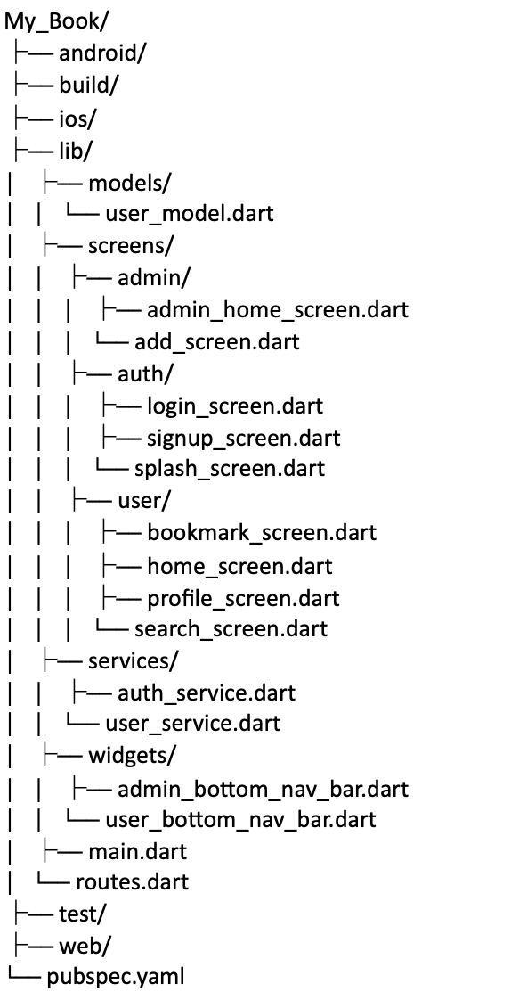

# BookApp similar to google book Api


## Screenshots

### App overView For Reference



## Installation

To get started with this project, follow these steps:

1. **Clone the repository:**
    ```bash
    git clone https://github.com/Siz-An/book.git
    ```

2. **Install dependencies:**
    ```bash
    flutter pub get
    ```

3. **Run the app:**
    ```bash
    flutter run
    ```

## Dependencies

#---------Firebase------------#

firebase_core: ^3.2.0
firebase_auth: ^5.1.2
cloud_firestore: ^5.1.0
google_sign_in: ^6.2.1
provider: ^6.1.2

#----------------------------#

## Contributing

Contributions are welcome! Please open an issue or submit a pull request.